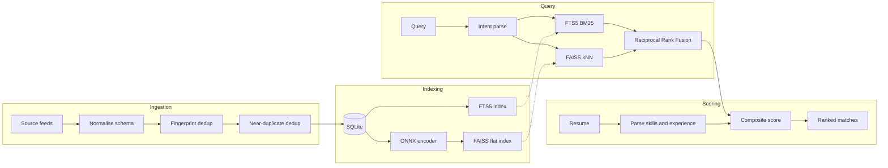

# Talently

A hybrid-retrieval job matching platform that pairs lexical and semantic search with resume-aware scoring, and grounds every generated artifact in source text rather than model recall.

---

## Overview

Job search tooling tends to fail in one of two directions. Keyword-driven boards return literal matches and miss equivalent phrasing, so a candidate searching "ML engineer" never sees the "Applied Scientist" posting they are qualified for. Embedding-driven boards return topical neighbours and lose precision, surfacing roles that read similar but do not match on skills or seniority. Both leave the candidate to manually reconcile their resume against every listing.

The corpus itself compounds the problem before search even runs: 45,107 postings aggregated across five sources carry the same opening reposted under slightly varied titles, inconsistent experience and salary encoding, and free-text skill lists with no controlled vocabulary. Naive keyword search over a corpus like this returns duplicates in the top ten and misses semantically equivalent titles entirely.

Talently addresses this on two levels: deduplication that removes near-identical reposts before indexing, and retrieval that fuses two independent ranking signals rather than relying on either alone. Matches are then scored against the candidate's actual resume across semantic, skill, and experience dimensions, and every generated document is checked against its source text before being returned.

### Scope

**In scope:** job ingestion and normalisation, deduplication, hybrid retrieval, resume parsing and scoring, skills-gap analysis, grounded generation covering cover letters, resume rewrites and interview preparation, market analytics, and retrieval quality evaluation.

**Out of scope:** employer-side posting and applicant tracking, authenticated multi-user accounts with server-side persistence, scheduled live scraping, and payment flows. Application tracking is client-side by design.

---

## Tech stack

**Backend.** FastAPI 0.110 on Uvicorn. SQLite in WAL mode with FTS5 for lexical retrieval. FAISS 1.8 for vector search. ONNX Runtime 1.23 with the standalone `tokenizers` library for embedding inference. PyMuPDF and python-docx for document parsing. NumPy 1.26.

**Frontend.** React 18 with Vite 5 and Tailwind 3. React Router 6 for routing, Recharts 2 for visualisation, Axios for transport, react-markdown for rendering generated content.

**Model.** all-MiniLM-L6-v2 exported to ONNX. 384 dimensions, 256-token window, mean pooling with L2 normalisation, single-threaded intra-op and inter-op execution.

**Generation.** Gemini, called with a client-supplied key per request and never persisted server-side. Every generative feature ships with a deterministic heuristic fallback, so the system degrades to rule-based behaviour rather than failing when no key is supplied.

---

## Key features

**Retrieval**
- Natural-language query parsing into structured filters, with regex fallback
- Hybrid lexical and semantic search across the corpus
- Filtering by location, source, experience band, domain, and posting age
- Similar-role retrieval from any posting

**Candidate matching**
- Resume ingestion from PDF, DOCX, TXT, and Markdown, capped at 10MB
- Skill and experience extraction against a controlled vocabulary
- Composite scoring with a deterministic, human-readable explanation per match
- Skills-gap analysis against live demand for a target role, with curated study links
- Comparison across up to three resume versions, returning either a recommendation or a merged draft

**Grounded generation**
- ATS keyword analysis against a specific posting
- Resume phrasing optimisation and weak-line rewriting with before-and-after scoring
- Cover letter drafting
- Interview preparation weighted toward the candidate's demonstrated gaps
- Career chat grounded in both the posting and the resume

**Analytics**
- Corpus-level distribution across sources, locations, domains, and seniority
- Salary percentiles and skill demand ranking
- Personalised market view computed over the candidate's qualifying matches
- Retrieval quality metrics exposed as a live endpoint

---

## How matching works

**Deduplication runs in three passes before anything is indexed.** Exact-match collapse fingerprints `company|title|location` as an MD5 hash at ingestion. Near-duplicate collapse then compares titles within each `(company, location)` bucket using sequence similarity at a 0.92 threshold, gated by four guards that prevent over-merging: seniority markers must agree, stated experience ranges must agree, the leading significant title token must match, and titles differing only by requisition-code tokens are held distinct. Surviving groups retain the most recent posting within a 548-day repost window. Search indexes are rebuilt against the deduplicated table so lexical and vector indexes never drift from the row set they describe.

**Retrieval fuses two independent rankers.** An FTS5 index provides BM25-ranked lexical retrieval. A FAISS flat index over the 384-dimensional embeddings provides semantic retrieval. Rather than blending raw scores, which requires calibrating incomparable scales, the two rank lists combine through Reciprocal Rank Fusion at `k=60`. Rank-based fusion is scale-free: it needs no normalisation and degrades gracefully when one ranker returns nothing useful.

**Candidate scoring is a weighted composite** applied to the fused candidate set:

```
composite = 0.40 * semantic + 0.40 * skills + 0.20 * experience
```

The semantic term is cosine similarity between the resume embedding and the job's precomputed vector, reconstructed directly from the FAISS index rather than re-embedded per request. The skills term is Jaccard overlap between extracted resume skills and job skills. The experience term scores 1.0 inside the stated band, decays linearly outside it, and defaults to 0.5 when a posting states no range, so unstated ranges neither reward nor penalise.



**Inference runs without a deep learning framework.** The embedding path uses ONNX Runtime and the standalone tokenizers library rather than sentence-transformers, which pulls PyTorch into the process for what is ultimately a six-layer forward pass. Exporting the model to ONNX removes that dependency, cutting baseline resident memory from roughly 390MB to 150MB. Output was verified numerically identical to the original sentence-transformers implementation at cosine similarity 1.0, so the offline-built index and the runtime query encoder share one vector space.

**Generated text is verified against its source before it is returned.** Cover letters, resume rewrites, and merged resumes each pass a word-overlap check against the originating resume and posting. Output falling below threshold is discarded in favour of the deterministic fallback.

---

## Measured results

Retrieval quality, measured across six probe queries spanning data, frontend, backend, DevOps, analytics, and product roles:

| Metric | Value |
|---|---|
| NDCG@10 | 0.971 |
| MRR | 1.000 |
| Faithfulness audit | Pass |

Per-query NDCG@10 ranges from 0.859 to 1.000, with the floor set by the product management probe, where relevance judgement is inherently softer than for technical roles. MRR of 1.000 indicates the first result was relevant for every probe. The faithfulness audit confirms the heuristic chat path does not introduce a salary figure when the underlying posting states none.

Ingestion throughput: streaming the source array element by element through `ijson` and deferring FTS5 indexing to a single bulk pass after insert reduced a full corpus load from a projected hour to roughly fifteen seconds, while holding peak memory in the tens of megabytes.

---

## API

| Method | Route | Purpose |
|---|---|---|
| GET | `/api/jobs` | Hybrid search with filters and pagination |
| GET | `/api/jobs/{id}` | Single posting |
| GET | `/api/jobs/{id}/similar` | Vector-neighbour postings |
| POST | `/api/recommendations/upload-resume` | Parse resume to text, skills, experience |
| POST | `/api/recommendations/match` | Score and rank postings against a resume |
| POST | `/api/recommendations/fit-score` | Single-posting score with explanation |
| POST | `/api/recommendations/skills-gap` | Held versus missing skills against demand |
| POST | `/api/recommendations/ats-analyze` | ATS keyword coverage |
| POST | `/api/recommendations/optimize-phrasing` | Bullet-level rewrite suggestions |
| POST | `/api/recommendations/boost-resume` | Weak-line rewrite with score delta |
| POST | `/api/recommendations/cover-letter` | Grounded cover letter |
| POST | `/api/recommendations/compare-resumes` | Recommend or merge across versions |
| POST | `/api/recommendations/personalized-analytics` | Market view over qualifying matches |
| POST | `/api/chat/parse-intent` | Query to structured filters |
| POST | `/api/chat` | Career chat grounded in posting and resume |
| POST | `/api/chat/interview-prep` | Gap-weighted interview questions |
| GET | `/api/analytics` | Corpus distributions and salary percentiles |
| GET | `/api/analytics/evaluation` | NDCG@10, MRR, faithfulness audit |

Model-backed endpoints accept an optional `X-Gemini-API-Key` header.

---

## Data model

The `jobs` table carries the normalised posting. `jobs_fts` is an FTS5 virtual table mirroring the searchable columns. `vector_mappings` binds FAISS ordinal positions to job identifiers, which lets the scorer reconstruct a stored vector by index position instead of re-encoding text at request time. Indexes cover source, location, the experience band, and fingerprint.

```
jobs(job_id PK, company_name, title, description, location, source, posted_at,
     salary_min, salary_max, experience_min, experience_max, skills,
     domain, fingerprint, created_at)

jobs_fts(job_id, title, company_name, description, skills)          -- FTS5

vector_mappings(faiss_index PK, job_id FK -> jobs.job_id)
```

---

## Repository map

```
job board/
├── backend/
│   ├── app/
│   │   ├── api/            jobs, recommendations, chat, analytics routers
│   │   ├── db/              SQLite connection, WAL setup, schema definitions
│   │   ├── services/         embedding_service (ONNX + FAISS), ai_service (Gemini
│   │   │                    + heuristic fallbacks), evaluation_service, learning_resources
│   │   ├── utils/            resume parsing (PDF/DOCX/TXT), skill and experience extraction
│   │   └── main.py           app wiring, CORS, startup schema init
│   ├── scripts/               offline pipeline: export_onnx_model, ingest_data,
│   │                          dedupe_near_duplicates, generate_embeddings
│   ├── tests/                 pipeline verification (WAL mode, FTS5/FAISS consistency)
│   └── data/                  jobs.db, jobs.faiss (generated, not hand-authored)
└── frontend/
    └── src/
        ├── pages/              Landing, Login, Home, JobDetails, Recommendations,
        │                      Analytics, Applications
        ├── context/             ResumeContext, ApplicationsContext (client-side state)
        ├── components/          ChatAssistant and shared UI
        └── services/            api.js, the single axios client boundary
```

---

## Environment variables

| Variable | Purpose |
| --- | --- |
| `DATABASE_PATH` | Path to the SQLite database file |
| `FAISS_INDEX_PATH` | Path to the FAISS index file |
| `EMBEDDING_MODEL` | Embedding model identifier (`all-MiniLM-L6-v2`) |
| `CORS_ORIGINS` | Comma-separated list of allowed frontend origins |
| `OMP_NUM_THREADS` | Caps BLAS/FAISS thread count; keeps memory and CPU usage predictable under concurrent requests |

`GEMINI_API_KEY` is never read from the environment in the running service. Every model-backed endpoint takes the key per request through an `X-Gemini-API-Key` header, so no key is stored server-side and a missing key simply routes to the heuristic path.

---

## Running locally

Backend:

```bash
cd backend
pip install -r requirements.txt
uvicorn app.main:app --reload
```

Frontend:

```bash
cd frontend
npm install
npm run dev
```

The API serves on port 8000 and the client on 5173.

Corpus preparation, in order:

```bash
python scripts/export_onnx_model.py      # one-time model conversion
python scripts/ingest_data.py            # normalise and fingerprint-dedup
python scripts/dedupe_near_duplicates.py # fuzzy dedup with guards
python scripts/generate_embeddings.py    # build FAISS index and mappings
```

Torch is a dependency of the conversion script alone and is never imported by the running service.

---

## Development and testing

```bash
# verify WAL mode, FTS5 row-count parity, and FAISS/vector_mappings consistency
python backend/tests/verify_pipeline.py

# retrieval quality: NDCG@10, MRR, faithfulness audit over probe queries
curl http://localhost:8000/api/analytics/evaluation

# frontend build check
cd frontend && npm run build
```

---

## Troubleshooting

- **FTS5 row count does not match the `jobs` table**: the FTS5 table is populated in a single bulk pass after ingestion rather than kept in sync incrementally; re-run `scripts/ingest_data.py` if the two have diverged, or run `verify_pipeline.py` to confirm.
- **FAISS search returns stale or missing results after a data change**: the index is rebuilt, not updated in place; re-run `scripts/generate_embeddings.py` after any change to `jobs.db` so `vector_mappings` and the FAISS file describe the same row set.
- **A generative feature always returns the heuristic version**: confirm the `X-Gemini-API-Key` header is present on the request; a missing or invalid key falls back silently by design rather than returning an error.
- **A resume upload is rejected**: only PDF, DOCX, TXT, and Markdown are supported, and the file must be under 10MB; corrupted PDFs and mislabeled DOCX files are normalised to a single readable error rather than an unhandled failure.
- **Cross-origin requests are blocked in the browser**: confirm the frontend origin is included in `CORS_ORIGINS`.

---

## Design decisions

**Rank fusion over score blending.** BM25 scores and L2 distances occupy different, corpus-dependent scales. Blending them requires normalisation that shifts as the corpus changes. Reciprocal Rank Fusion consumes only ordinal position, which makes it stable across corpus changes and robust when one ranker returns weak results.

**Deduplication before indexing, not at query time.** Filtering duplicates during retrieval would mean paying the cost on every request and returning inconsistent result counts. Collapsing at ingestion keeps both indexes and the row set in agreement.

**Guarded fuzzy matching.** A bare similarity threshold merges "Engineer II" into "Engineer" and collapses genuinely distinct openings. Each of the four guards corresponds to an observed over-merge in the corpus.

**Vector reconstruction over re-encoding.** Scoring a resume against 500 candidates by re-encoding each posting would run 500 forward passes per request. Reconstructing stored vectors by index position reduces that to a single pass for the resume.

**Deferred FTS5 indexing.** Incremental FTS5 updates slow as the index grows and come to dominate ingestion on a large corpus. Building the index in one bulk pass after insert trades a small amount of peak memory for an order-of-magnitude reduction in load time.

**Deterministic fallbacks throughout.** Every model-backed feature has a rule-based implementation behind it. The system remains functional without a model key; generation quality degrades, availability does not.

**Overlap verification on generated text.** Fluent output that invents an employer, a date, or a figure is worse than blunt output that does not. Requiring lexical overlap with source text is a cheap, deterministic check against the failure mode that matters most in candidate-facing documents.
