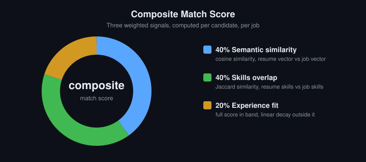
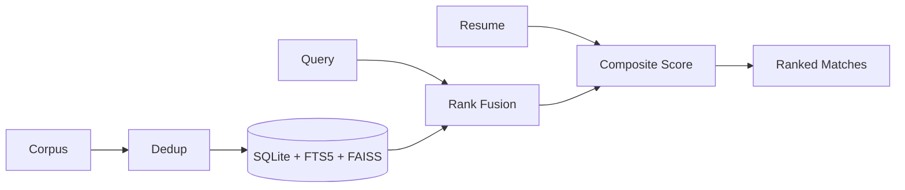
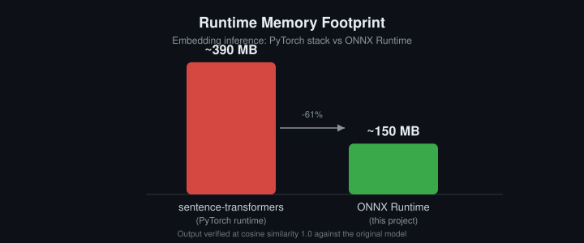
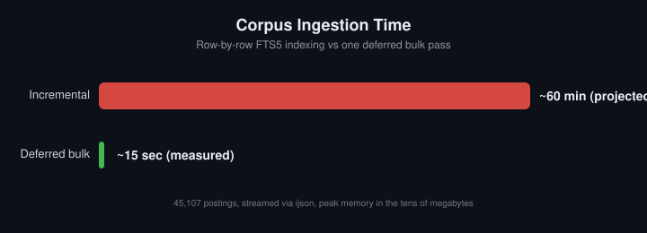
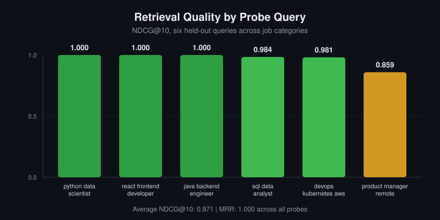

<div align="center">

# Talently

[](https://talentlyfusion.vercel.app)

[](#)
[](#)
[](#)
[](#)
[](#)
[](#)

### *Hybrid retrieval and resume-aware matching, built so search stays accurate on messy data and generated text never lies to the reader.*

[](#measured-results)
[](#measured-results)
[](#the-corpus-problem)

</div>

---

## The Corpus Problem

Every job board inherits the same two failures.

Search on keywords, and "ML engineer" never finds "Applied Scientist," even though it is the same job under a different name. Search on meaning alone, and precision collapses, the results feel related but stop matching your actual skills or seniority.

Underneath both, the data itself resists cleanup. **45,107 postings**, aggregated across five sources, with the same opening reposted under drifting titles, inconsistent salary and experience encoding, and skills written as free text with no shared vocabulary.

Talently was built to survive exactly that: retrieval that stays accurate when the data is dirty, and generation that is checked against its source before a candidate ever reads it.

---

## How Talently Works

<div align="center">

<table>
<tr>
<td align="center" valign="top" width="25%">

### Corpus

</td>
<td align="center" valign="top" width="25%">

### Retrieval

</td>
<td align="center" valign="top" width="25%">

### Scoring

</td>
<td align="center" valign="top" width="25%">

### Generation

</td>
</tr>
<tr>
<td align="center" valign="top" width="25%">

Fingerprint dedup
Fuzzy dedup, 4 guards
FTS5 + FAISS indexing

</td>
<td align="center" valign="top" width="25%">

BM25 lexical rank
FAISS semantic rank
Reciprocal Rank Fusion

</td>
<td align="center" valign="top" width="25%">

40% semantic
40% skills
20% experience

</td>
<td align="center" valign="top" width="25%">

Gemini, grounded
Word-overlap check
Heuristic fallback

</td>
</tr>
</table>

</div>

---

## The Matching Pipeline

```
Dedup       exact fingerprint  ->  fuzzy title match (0.92, 4 guards)  ->  keep newest within 548 days
Retrieval   FTS5 BM25   ->\
            FAISS kNN   -->  Reciprocal Rank Fusion (k=60)  ->  fused candidates
Scoring     0.40 semantic + 0.40 skills (Jaccard) + 0.20 experience  ->  ranked matches
```



**Dedup guards** stop over-merging. Seniority markers must agree. Experience ranges must agree. The leading title token must match. Requisition-code-only differences stay distinct. Without these four checks, "Engineer II" quietly collapses into "Engineer."

**Rank fusion, not score blending.** BM25 scores and vector distances sit on different scales, so fusing raw numbers is fragile. Fusing by rank position needs no normalisation and stays stable as the corpus grows.

**Vector reconstruction, not re-embedding.** Scoring a resume against 500 candidates reconstructs each job's stored vector by index position instead of re-running the model, turning 500 forward passes into one.

**Generated text is checked before it's shown.** Cover letters, rewrites, and merged resumes are compared against the source resume and posting for lexical overlap. Fall below threshold, and the output is discarded for a deterministic version instead.



---

## No Deep Learning Framework at Runtime



`sentence-transformers` pulls PyTorch into the process for what is, at inference time, a six-layer forward pass. The embedding model is exported to ONNX once, offline; the live service runs on ONNX Runtime and a standalone tokenizer instead. Output was verified numerically identical to the original model, cosine similarity 1.0, so nothing about accuracy was traded for the memory cut.



Incremental FTS5 updates slow down as an index grows and come to dominate ingestion time on a large corpus. Deferring indexing to a single bulk pass after insert, combined with streaming the source file through `ijson` instead of loading it whole, keeps peak memory in the tens of megabytes regardless of corpus size.

---

## Measured Results



| Metric | Value | What it means |
|---|---|---|
| NDCG@10 | **0.971** | The top 10 results are ranked correctly, almost every time |
| MRR | **1.000** | The first result was relevant on every single probe query |
| Faithfulness audit | **Pass** | The system never invents a salary figure absent from the posting |

The lowest-scoring probe is product management, where relevance judgement is inherently softer than for a technical role like frontend development, where the skill match is close to binary. This isn't a number run once and archived. It's exposed as a live endpoint, recomputed on demand.

---

## What's Inside

**Retrieval**
- Natural-language query parsing into structured filters, with a regex fallback
- Hybrid lexical and semantic search across the full corpus
- Filtering by location, source, experience band, domain, and posting age
- Similar-role retrieval from any posting

**Candidate matching**
- Resume ingestion from PDF, DOCX, TXT, and Markdown, capped at 10MB
- Skill and experience extraction against a controlled vocabulary
- Composite scoring with a deterministic, human-readable explanation per match
- Skills-gap analysis against live demand for a target role, with curated study links
- Comparison across up to three resume versions, returning a recommendation or a merged draft

**Grounded generation**
- ATS keyword analysis against a specific posting
- Resume phrasing optimisation and weak-line rewriting with before-and-after scoring
- Cover letter drafting
- Interview preparation weighted toward the candidate's demonstrated gaps
- Career chat grounded in both the posting and the resume

**Analytics**
- Corpus-level distribution across sources, locations, domains, and seniority
- Salary percentiles and skill demand ranking
- Personalised market view over the candidate's qualifying matches
- Retrieval quality metrics exposed as a live endpoint

---

## Where the Model Is Used, and Where It Isn't

| Layer | Powered by |
|---|---|
| Search, ranking, scoring, deduplication | Deterministic code, no model call |
| Cover letters, resume rewrites, interview prep, chat | Gemini, with a heuristic fallback on every single one |

Every model-backed feature ships with a rule-based fallback that runs when no API key is supplied, or when the model call fails. ATS matching falls back to direct keyword presence checking. Resume rewriting falls back to pattern-based phrasing fixes. Interview prep falls back to a skill-gap-weighted question bank. Nothing goes dark; generation quality degrades, availability does not.

---

## Data Model

```
jobs(job_id PK, company_name, title, description, location, source, posted_at,
     salary_min, salary_max, experience_min, experience_max, skills,
     domain, fingerprint, created_at)

jobs_fts(job_id, title, company_name, description, skills)          -- FTS5

vector_mappings(faiss_index PK, job_id FK -> jobs.job_id)
```

`vector_mappings` binds FAISS index position to job id, which is what makes vector reconstruction possible instead of re-encoding on every scoring pass.

---

## Repository Map

```
job board/
├── backend/
│   ├── app/
│   │   ├── api/            jobs, recommendations, chat, analytics routers
│   │   ├── db/              SQLite connection, WAL setup, schema definitions
│   │   ├── services/         embedding_service (ONNX + FAISS), ai_service (Gemini
│   │   │                    + heuristic fallbacks), evaluation_service, learning_resources
│   │   ├── utils/            resume parsing (PDF/DOCX/TXT), skill and experience extraction
│   │   └── main.py           app wiring, CORS, startup schema init
│   ├── scripts/               offline pipeline: export_onnx_model, ingest_data,
│   │                          dedupe_near_duplicates, generate_embeddings
│   ├── tests/                 pipeline verification (WAL mode, FTS5/FAISS consistency)
│   └── data/                  jobs.db, jobs.faiss (generated, not hand-authored)
└── frontend/
    └── src/
        ├── pages/              Landing, Login, Home, JobDetails, Recommendations,
        │                      Analytics, Applications
        ├── context/             ResumeContext, ApplicationsContext (client-side state)
        ├── components/          ChatAssistant and shared UI
        └── services/            api.js, the single axios client boundary
```

---

## Environment Variables

| Variable | Purpose |
| --- | --- |
| `DATABASE_PATH` | Path to the SQLite database file |
| `FAISS_INDEX_PATH` | Path to the FAISS index file |
| `EMBEDDING_MODEL` | Embedding model identifier (`all-MiniLM-L6-v2`) |
| `CORS_ORIGINS` | Comma-separated list of allowed frontend origins |
| `OMP_NUM_THREADS` | Caps BLAS/FAISS thread count for predictable memory and CPU use |

`GEMINI_API_KEY` is never read server-side. Every model-backed endpoint takes the key per request via `X-Gemini-API-Key`; a missing key routes to the heuristic path.

---

## Running Locally

Backend:

```bash
cd backend
pip install -r requirements.txt
uvicorn app.main:app --reload
```

Frontend:

```bash
cd frontend
npm install
npm run dev
```

API on port 8000, client on 5173.

Corpus preparation, in order:

```bash
python scripts/export_onnx_model.py      # one-time model conversion
python scripts/ingest_data.py            # normalise and fingerprint-dedup
python scripts/dedupe_near_duplicates.py # fuzzy dedup with guards
python scripts/generate_embeddings.py    # build FAISS index and mappings
```

Torch is a dependency of the conversion script alone; the running service never imports it.

---

## Development and Testing

```bash
# WAL mode, FTS5 row-count parity, FAISS/vector_mappings consistency
python backend/tests/verify_pipeline.py

# retrieval quality: NDCG@10, MRR, faithfulness audit
curl http://localhost:8000/api/analytics/evaluation

# frontend build check
cd frontend && npm run build
```

---

## Troubleshooting

- **FTS5 count mismatch:** the table populates in one bulk pass after ingestion, not incrementally. Re-run `ingest_data.py` or check with `verify_pipeline.py`.
- **Stale FAISS results:** the index rebuilds rather than updates in place. Re-run `generate_embeddings.py` after any change to `jobs.db`.
- **Generative feature returns only the heuristic version:** confirm `X-Gemini-API-Key` is present; a missing or invalid key falls back silently by design.
- **Resume upload rejected:** only PDF, DOCX, TXT, and Markdown are supported, under 10MB. Corrupted or mislabeled files return one clean error.
- **CORS errors in the browser:** confirm the frontend origin is listed in `CORS_ORIGINS`.
