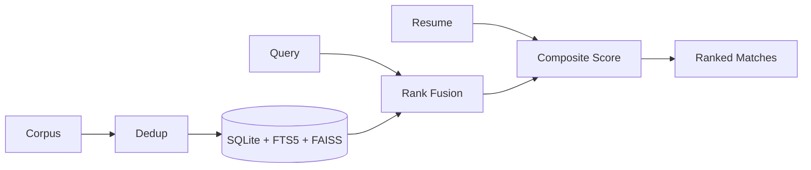

# Talently

A hybrid-retrieval job matching platform that pairs lexical and semantic search with resume-aware scoring, and grounds every generated artifact in source text rather than model recall.

---

## Problem and Approach

Keyword-only search misses equivalent phrasing ("ML engineer" never surfaces "Applied Scientist").
Embedding-only search loses precision (topical neighbours that don't match on skill or seniority).

**The corpus makes this worse:** 45,107 postings across five sources, full of reposted duplicates under varied titles, inconsistent salary/experience encoding, and free-text skills with no controlled vocabulary.

```
Dedup at ingestion  ->  Hybrid retrieval (lexical + semantic)  ->  Resume-aware composite score  ->  Grounded generation
```

**In scope:** ingestion and dedup, hybrid retrieval, resume parsing and scoring, skills-gap analysis, grounded generation (cover letters, resume rewrites, interview prep), market analytics, retrieval evaluation.

**Out of scope:** employer-side posting/ATS, server-side multi-user accounts, scheduled live scraping, payments. Application tracking is client-side by design.

---

## Tech Stack

| Layer | Technology | Role |
| --- | --- | --- |
| API | FastAPI, Uvicorn | Request handling and routing |
| Datastore | SQLite (WAL mode) | Primary storage |
| Lexical search | SQLite FTS5, BM25 | Keyword retrieval |
| Vector search | FAISS (flat index) | Semantic retrieval |
| Embeddings | ONNX Runtime, tokenizers | Model inference, no PyTorch |
| Embedding model | all-MiniLM-L6-v2 | 384-dim sentence vectors |
| Document parsing | PyMuPDF, python-docx | PDF and DOCX resume extraction |
| Generation | Gemini | Cover letters, rewrites, chat, interview prep |
| Frontend | React 18, Vite 5 | Application shell and build |
| Styling | Tailwind 3 | UI |
| Routing | React Router 6 | Client navigation |
| Charts | Recharts 2 | Analytics visualisation |
| Transport | Axios | API client |

---

## Key Features

**Retrieval**
- Natural-language query parsing into structured filters, with regex fallback
- Hybrid lexical and semantic search across the corpus
- Filtering by location, source, experience band, domain, and posting age
- Similar-role retrieval from any posting

**Candidate matching**
- Resume ingestion from PDF, DOCX, TXT, and Markdown, capped at 10MB
- Skill and experience extraction against a controlled vocabulary
- Composite scoring with a deterministic, human-readable explanation per match
- Skills-gap analysis against live demand for a target role, with curated study links
- Comparison across up to three resume versions, returning a recommendation or a merged draft

**Grounded generation**
- ATS keyword analysis against a specific posting
- Resume phrasing optimisation and weak-line rewriting with before-and-after scoring
- Cover letter drafting
- Interview preparation weighted toward the candidate's demonstrated gaps
- Career chat grounded in both the posting and the resume

**Analytics**
- Corpus-level distribution across sources, locations, domains, and seniority
- Salary percentiles and skill demand ranking
- Personalised market view over the candidate's qualifying matches
- Retrieval quality metrics exposed as a live endpoint

---

## Matching Pipeline

```
Dedup       exact fingerprint  ->  fuzzy title match (0.92 threshold, 4 guards)  ->  keep newest within 548 days  ->  index rebuild
Retrieval   FTS5 BM25   ->\
            FAISS kNN   -->  Reciprocal Rank Fusion (k=60)  ->  fused candidates
Scoring     0.40 semantic + 0.40 skills (Jaccard) + 0.20 experience  ->  ranked matches
```

- **Dedup guards** prevent over-merging: seniority markers must agree, stated experience ranges must agree, the leading title token must match, requisition-code-only differences are held distinct. Without these, "Engineer II" collapses into "Engineer."
- **Rank fusion, not score blending.** BM25 and L2 distance sit on different scales; fusing by rank position needs no normalisation and stays stable as the corpus changes.
- **Vector reconstruction, not re-embedding.** Resume-to-job scoring reconstructs each job's stored vector by index position, turning what would be one forward pass per candidate into one pass total.
- **No deep learning framework at runtime.** ONNX Runtime replaces sentence-transformers/PyTorch, cutting baseline memory from roughly 390MB to 150MB, verified at cosine similarity 1.0 against the original model.
- **Generated text is checked against its source.** Cover letters, rewrites, and merged resumes require lexical overlap with the originating resume and posting before being returned; anything below threshold falls back to a deterministic version.



---

## Measured Results

| Metric | Value |
|---|---|
| NDCG@10 | 0.971 |
| MRR | 1.000 |
| Faithfulness audit | Pass |

- Per-query NDCG@10 ranges 0.859 to 1.000; floor is the product-management probe, where relevance judgement is inherently softer than for technical roles.
- MRR of 1.000: the first result was relevant on every probe query.
- Faithfulness audit confirms the heuristic chat path never invents a salary figure absent from the posting.
- Ingestion: streamed parsing keeps peak memory in the tens of megabytes; deferring FTS5 indexing to one bulk pass cut a full corpus load from a projected hour to roughly fifteen seconds.

---

## Data Model

- `jobs`: the normalised posting record
- `jobs_fts`: FTS5 mirror of the searchable columns
- `vector_mappings`: binds FAISS index position to job id, enabling reconstruction instead of re-encoding

```
jobs(job_id PK, company_name, title, description, location, source, posted_at,
     salary_min, salary_max, experience_min, experience_max, skills,
     domain, fingerprint, created_at)

jobs_fts(job_id, title, company_name, description, skills)          -- FTS5

vector_mappings(faiss_index PK, job_id FK -> jobs.job_id)
```

---

## Repository Map

```
job board/
├── backend/
│   ├── app/
│   │   ├── api/            jobs, recommendations, chat, analytics routers
│   │   ├── db/              SQLite connection, WAL setup, schema definitions
│   │   ├── services/         embedding_service (ONNX + FAISS), ai_service (Gemini
│   │   │                    + heuristic fallbacks), evaluation_service, learning_resources
│   │   ├── utils/            resume parsing (PDF/DOCX/TXT), skill and experience extraction
│   │   └── main.py           app wiring, CORS, startup schema init
│   ├── scripts/               offline pipeline: export_onnx_model, ingest_data,
│   │                          dedupe_near_duplicates, generate_embeddings
│   ├── tests/                 pipeline verification (WAL mode, FTS5/FAISS consistency)
│   └── data/                  jobs.db, jobs.faiss (generated, not hand-authored)
└── frontend/
    └── src/
        ├── pages/              Landing, Login, Home, JobDetails, Recommendations,
        │                      Analytics, Applications
        ├── context/             ResumeContext, ApplicationsContext (client-side state)
        ├── components/          ChatAssistant and shared UI
        └── services/            api.js, the single axios client boundary
```

---

## Environment Variables

| Variable | Purpose |
| --- | --- |
| `DATABASE_PATH` | Path to the SQLite database file |
| `FAISS_INDEX_PATH` | Path to the FAISS index file |
| `EMBEDDING_MODEL` | Embedding model identifier (`all-MiniLM-L6-v2`) |
| `CORS_ORIGINS` | Comma-separated list of allowed frontend origins |
| `OMP_NUM_THREADS` | Caps BLAS/FAISS thread count for predictable memory and CPU use |

`GEMINI_API_KEY` is never read server-side. Every model-backed endpoint takes the key per request via `X-Gemini-API-Key`; a missing key routes to the heuristic path.

---

## Running Locally

Backend:

```bash
cd backend
pip install -r requirements.txt
uvicorn app.main:app --reload
```

Frontend:

```bash
cd frontend
npm install
npm run dev
```

API on port 8000, client on 5173.

Corpus preparation, in order:

```bash
python scripts/export_onnx_model.py      # one-time model conversion
python scripts/ingest_data.py            # normalise and fingerprint-dedup
python scripts/dedupe_near_duplicates.py # fuzzy dedup with guards
python scripts/generate_embeddings.py    # build FAISS index and mappings
```

Torch is a dependency of the conversion script alone; the running service never imports it.

---

## Development and Testing

```bash
# WAL mode, FTS5 row-count parity, FAISS/vector_mappings consistency
python backend/tests/verify_pipeline.py

# retrieval quality: NDCG@10, MRR, faithfulness audit
curl http://localhost:8000/api/analytics/evaluation

# frontend build check
cd frontend && npm run build
```

---

## Troubleshooting

- **FTS5 count mismatch:** the table populates in one bulk pass after ingestion, not incrementally. Re-run `ingest_data.py` or check with `verify_pipeline.py`.
- **Stale FAISS results:** the index rebuilds rather than updates in place. Re-run `generate_embeddings.py` after any change to `jobs.db`.
- **Generative feature returns only the heuristic version:** confirm `X-Gemini-API-Key` is present; a missing or invalid key falls back silently by design.
- **Resume upload rejected:** only PDF, DOCX, TXT, and Markdown are supported, under 10MB. Corrupted or mislabeled files return one clean error.
- **CORS errors in the browser:** confirm the frontend origin is listed in `CORS_ORIGINS`.
